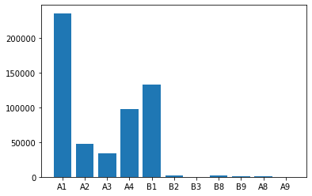
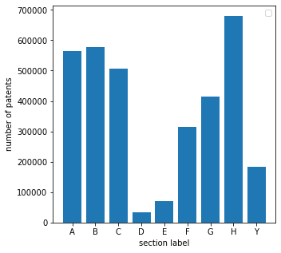
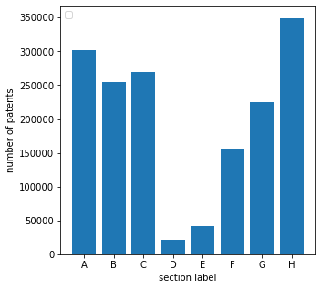

# EP Analysis
This folder will contain the analysis for the EP Core Vertical. It includes scripts and data related to both statistical and NLP analysis of patent documents within the EP vertical, offering valuable insights into the specific characteristics and trends of this vertical. 

## Plotting the Distribution of Patent Documents per Kind Code

## Plotting the Distribution of Patent Documents per CPC Section Label

## Plotting the Distribution of Patent Documents per IPCR Section Label

