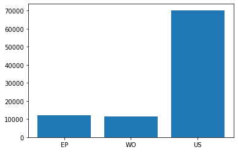

## 📊 Dataset Statistics

### 🧾 General Information
- **Total patents**: 93,589  
- **Total unique labels**: 602 subclasses 5,392 groups 

### 📁 Dataset Splits
| Split       | # of Patents |
|-------------|--------------|
| Train       | 71,407       |
| Validation  | 11,065       |
| Test        | 11,117       |

---

### 🏷️ Label Coverage per Split

#### 🔹 Subclass Counts
| Split       | # of Subclasses |
|-------------|-----------------|
| Train       | 598             |
| Validation  | 534             |
| Test        | 534             |
| **Total**   | 602             |

#### 🔹 Group Counts
| Split       | # of Groups     |
|-------------|-----------------|
| Train       | 5,201           |
| Validation  | 2,904           |
| Test        | 2,911           |
| **Total**   | 5,392           |

---

### 🔄 Label Overlap Between Splits

#### 📌 Subclass Differences
- In **validation** but **not in train**: 114  
- In **train** but **not in validation**: 2,411  
- In **test** but **not in train**: 94  
- In **train** but **not in test**: 2,384  

#### 📌 Group Differences
- In **validation** but **not in train**: 1  
- In **train** but **not in validation**: 65  
- In **test** but **not in train**: 1  
- In **train** but **not in test**: 65  

---

## Plots
### Distribution per office

---

For more details on the dataset preparation pipeline and objectives, refer to the [📄 Documentation: Patent Classification Dataset Preparation Pipeline](https://github.com/cs1msa/WPIplus/tree/main/Collection%20Verticals%20(subsets)/%23HelloWorldSample2).

---

## 💻 Source Code

- For accessing the dataset preparation pipeline, refer to this notebook: [📄 Subpart Creation - EP, US, WO_all_ipcr](https://github.com/cs1msa/WPIplus/blob/main/Collection%20Verticals%20(subsets)/Source%20Code/Subpart%20Creation%20-%20EP%2C%20US%2C%20WO_all_ipcr.ipynb).
- For parsing the EP, WO, and US collections, see: [📄 Parsing subpart.ipynb](https://github.com/cs1msa/WPIplus/blob/main/Collection%20Verticals%20(subsets)/Source%20Code/Parsing%20subpart.ipynb).
