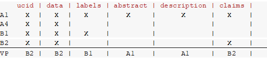

# Collection Verticals Organization

This repository provides access to multiple curated verticals within the WPI+ patent dataset. Each vertical serves a specific purpose, such as supporting access to specific patent offices, prior-art searches, classification tasks, or providing unified patent views through virtual patents.

---

## 📑 Table of Contents

- [📚 Core Verticals](#-core-verticals)
- [🌐 "All English Text" Vertical for Prior-Art Search](#-all-english-text-vertical-for-prior-art-search-tasks)
  - [📑 Sample Subset](#-sample-subset)
- [🧪 Stratified Samples for Classification Tasks](#-stratified-samples-for-classification-tasks)
- [🧩 Virtual Patent EP Vertical](#-virtual-patent-ep-vertical)
- [❓ What Are Virtual Patents?](#-what-are-virtual-patents)
  - [📷 VP Construction Example](#vp-construction-example)

---

## 📚 Core Verticals  
📁 [#EP, #WO, #US, #CH, #KR, #JP](https://github.com/cs1msa/WPIplus/tree/main/Collection%20Verticals%20(subsets)/Core%20Verticals%20%23EP%2C%20%23WO%2C%20%23US%2C%20%23CH%2C%20%23KR%2C%20%23JP)

These are the core verticals of the WPI+ collection, containing all patent documents from the following jurisdictions:

- **EP**: European Patent Office  
- **WO**: World Intellectual Property Organization 
- **US**: United States Patent and Trademark Office  
- **CH**: China National Intellectual Property Administration  
- **KR**: Korean Intellectual Property Office  
- **JP**: Japan Patent Office

---

## 🌐 "All English Text" Vertical for Prior-Art Search Tasks  
📁 [#(EP, WO, US)en-all](https://github.com/cs1msa/WPIplus/tree/main/Collection%20Verticals%20(subsets)/%23(EPO%2CWO%2CUS)en-all%20-%20Created%20for%20Priot-Art%20Search%20Tasks)

This vertical includes EP, WO, and US patent documents where all key text fields—**abstract**, **description**, and **claims**—are written in English. It is designed to support **prior-art search** and **natural language processing** applications.

### 📑 Sample Subset of "All English Text"
📁 [#Sample(EPO,WO,US)en-all](https://github.com/cs1msa/WPIplus/tree/main/Collection%20Verticals%20(subsets)/%23Sample(EPO%2CWO%2CUS)en-all%20-%20Created%20for%20Priot-Art%20Search%20Tasks)

A sample subset of 60,000 documents from the above vertical. Ideal for quick experimentation.

---

## 🧪 Stratified Samples of #EP, #WO, #US Verticals for Classification Tasks  
📁 [#StratifiedSample(EPO,WO,US)en-all](https://github.com/cs1msa/WPIplus/tree/main/Collection%20Verticals%20(subsets)/%23StratifiedSample(EPO%2CWO%2CUS)en-all%20-%20Created%20for%20Classification%20Tasks)

This vertical provides two stratified, balanced datasets derived from the EP, WO, and US core verticals. These datasets are structured for **supervised learning**, especially **classification tasks**.

---

## 🧩 Virtual Patent Verticals  
📁 [#VPep](https://github.com/cs1msa/WPIplus/tree/main/Collection%20Verticals%20(subsets)/%23VPep)

The **VPep** vertical contains **Virtual Patents** for the EP dataset. These documents are created by merging different versions (kind codes like A1, A2, B1, B2) of the same patent to produce a unified, up-to-date representation.

---

## ❓ What Are Virtual Patents?

A **Virtual Patent (VP)** is a synthesized document that consolidates the most recent and complete information for a single patent. Since a single patent may be published multiple times under different kind codes (e.g., A1, A2, B1, B2), no one document typically contains all available data.

By merging fields across these publications, VPs enable better analysis, full-text search, and up-to-date understanding of the patent's evolution.

> 🔍 **Use Case**: Working with VPs ensures you're analyzing the most complete and accurate patent data available.

### VP Construction Example:

